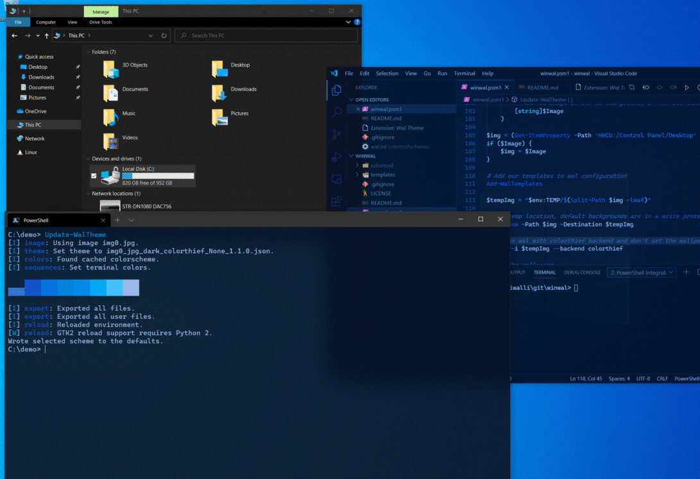
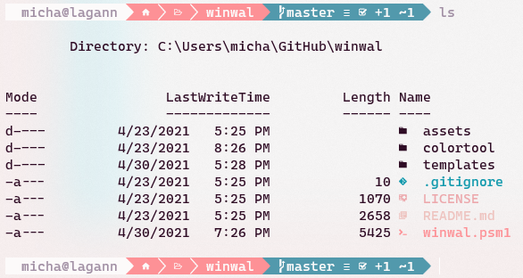

# winwal

A wrapper around [pywal](https://github.com/dylanaraps/pywal) for Windows.


Art from [wallpaperhub](https://wallpaperhub.app/)

## Dependencies

Only 1 backend is needed to get started, but each backend will provide slightly different color schemes.

pywal supports more backends, but I have not tried figuring them all out on Windows yet.

Use [`pip`](https://pypi.org/project/pip/) to install:
- [pywal](https://github.com/dylanaraps/pywal)
- [colorthief](https://github.com/fengsp/color-thief-py)
- [colorz](https://github.com/metakirby5/colorz)
- [haishoku](https://github.com/LanceGin/haishoku)

For `wal` Backend, install [ImageMagick](https://imagemagick.org/) and add to path:

```powershell
choco install -y imagemagick
```

**Windows on ARM64** Please install the static version of ImageMagick from their [downloads](https://imagemagick.org/script/download.php#windows) to avoid issues.

For [schemer2](https://github.com/thefryscorer/schemer2) backend, install [Go](https://golang.org/doc/install) and run:

```powershell
go install github.com/thefryscorer/schemer2@latest
```

[PowerShell-Core](https://github.com/powershell/powershell/) `winget install -e Microsoft.PowerShell`

Note: PowerShell versions less that 6 don't support JSON with comments

```powershell
winget install Python
pip install pywal colorthief colorz haishoku
```

## Installing

Clone the repository and update your powershell profile to have:

```powershell
Import-Module .\path\to\winwal.psm1
```

To open your profile with code:
```powershell
code $profile
```

## Using

To update wal cache Windows Terminal Color Scheme using the current wallpaper:
```powershell
Update-WalTheme
```

To use a different backend with the current wallpaper:
```powershell
Update-WalTheme -Backend haishoku
```

To update wal cache, Windows Terminal Color Scheme, and set the desktop wallpaper:
```powershell
Update-WalTheme -Image .\path\to\new\background.jpg
```

To update Windows Terminal Color Scheme with existing wal cache:
```powershell
Update-WalTerminal
```

To update pwsh prompt (not [Windows Terminal](https://docs.microsoft.com/en-us/windows/terminal/)):
```powershell
Update-WalCommandPrompt
```

Notes: `Update-WalCommandPrompt` will download [ColorTool](https://devblogs.microsoft.com/commandline/introducing-the-windows-console-colortool/) and use it to set the new default color schemes.

## Keep WSL in sync

I have pywal installed in WSL and create a symbolic link in WSL so I only have to update in Windows and it gets mirrored in WSL:

```sh
ln -s /mnt/c/Users/username/.cache/wal ~/.cache/wal
```

There's also instructions in [pywal](https://github.com/dylanaraps/pywal) on setting up your dot files that need to be followed (look for .bashrc instructions).

## VS Code Plugins Used
- [wal-theme](https://marketplace.visualstudio.com/items?itemName=dlasagno.wal-theme)
- [GlassIt-VSC](https://marketplace.visualstudio.com/items?itemName=s-nlf-fh.glassit)

## Recommended PowerShell Modules


- [Terminal-Icons](https://github.com/devblackops/Terminal-Icons) (requires using a [nerd font](https://www.nerdfonts.com/))
- [oh-my-posh](https://ohmyposh.dev/)
