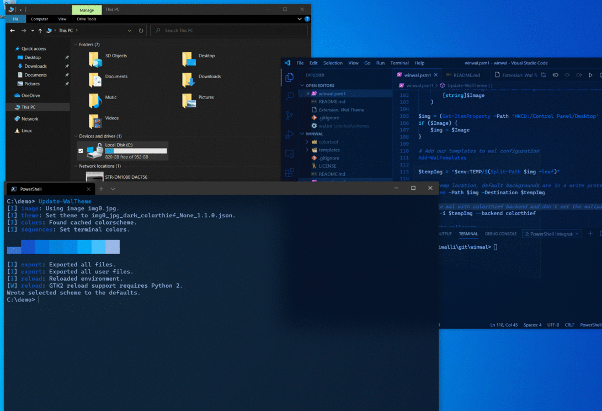
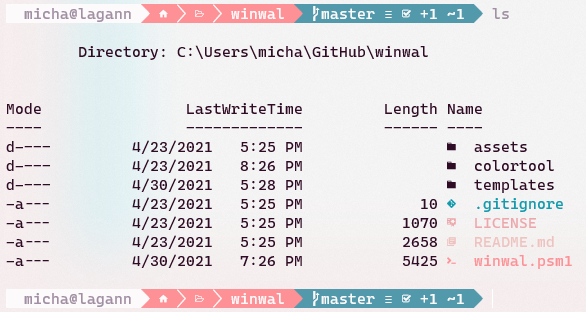

# winwal

A wrapper around [pywal16](https://github.com/eylles/pywal16) for Windows. (Original [pywal](https://github.com/dylanaraps/pywal) has been archived by author, pywal16 is recommended moving forward).


Art from [wallpaperhub](https://wallpaperhub.app/)

## Dependencies

Only 1 backend is needed to get started, but each backend will provide slightly different color schemes.

pywal supports more backends, but I have not tried figuring them all out on Windows yet.

Use [`pip`](https://pypi.org/project/pip/) to install:

- [pywal16](https://github.com/eylles/pywal16)
- [colorthief](https://github.com/fengsp/color-thief-py)
- [colorz](https://github.com/metakirby5/colorz) (does not install on arm64 versions of Python on Windows)
- [haishoku](https://github.com/LanceGin/haishoku)

For `wal` Backend, install [ImageMagick](https://imagemagick.org/) and add the install directory to your path:

```powershell
winget install imagemagick.imagemagick
```

**Windows on ARM64** Please install the static version of ImageMagick from their [downloads](https://imagemagick.org/script/download.php#windows) to avoid issues.

For [schemer2](https://github.com/thefryscorer/schemer2) backend, install [Go](https://golang.org/doc/install) and run:

```powershell
go install github.com/thefryscorer/schemer2@latest
```

[PowerShell-Core](https://github.com/powershell/powershell/) `winget install -e Microsoft.PowerShell`

Note: PowerShell versions less that 6 don't support JSON with comments

```powershell
winget install Python.Python.3.13
pip install pywal16 colorthief colorz haishoku
```

## Installing

Clone the repository and update your powershell profile to have:

```powershell
Import-Module .\path\to\winwal.psm1
```

To open your profile with code:

```powershell
code $profile
```

### PowerShell profile and Oh My Posh

Add winwal to your PowerShell `$PROFILE` so `Update-WalTheme` is available in new terminals. If you cloned this repo to `C:\Users\you\GitHub\winwal`, use:

```powershell
Import-Module "C:\Users\you\GitHub\winwal\winwal.psm1"
```

If you use Oh My Posh, keep your own theme initialization in `$PROFILE` with a `--config` path:

```powershell
oh-my-posh init pwsh --config "$HOME\.config\oh-my-posh\my-theme.omp.json" | Invoke-Expression
```

Then run winwal when you want to refresh colors:

```powershell
Update-WalTheme
```

On later runs, winwal updates the wal cache and templates, detects the active Oh My Posh config from `$env:POSH_THEME` or from `oh-my-posh init pwsh --config ...` / `-c ...` lines in your PowerShell profile, and refreshes that same config. If the detected config points to a wal-generated Oh My Posh theme, the refreshed prompt uses the new wal colors; winwal does not switch you to a bundled theme.

If you do not use Oh My Posh, do not add an Oh My Posh line. Starship and other prompt users can keep their existing profile setup; winwal only refreshes Oh My Posh when `oh-my-posh` is installed and a supported config path is detected.

## Using

To update wal cache Windows Terminal Color Scheme using the current wallpaper:

```powershell
Update-WalTheme
```

To use a different backend with the current wallpaper:

```powershell
Update-WalTheme -Backend haishoku
```

To update wal cache, Windows Terminal Color Scheme, and set the desktop wallpaper:

```powershell
Update-WalTheme -Image .\path\to\new\background.jpg
```

Notes: winwal will download [ColorTool](https://devblogs.microsoft.com/commandline/introducing-the-windows-console-colortool/) and use it to set the new default color schemes to cmd.exe.

## Keep WSL in sync

In WSL, you can symlink the wal cache directory to the Windows directory:

```sh
ln -s /mnt/c/Users/username/.cache/wal ~/.cache/wal
```

There's also instructions in [pywal](https://github.com/dylanaraps/pywal) on setting up your dot files that need to be followed (look for .bashrc instructions).

## VS Code Plugins Used

- [wal-theme](https://marketplace.visualstudio.com/items?itemName=dlasagno.wal-theme) - Wal Theme for VS Code
- [GlassIt-VSC](https://marketplace.visualstudio.com/items?itemName=s-nlf-fh.glassit) - Transparency for VS Code

## Recommended PowerShell Modules



- [Terminal-Icons](https://github.com/devblackops/Terminal-Icons) (requires using a [nerd font](https://www.nerdfonts.com/))
- [oh-my-posh](https://ohmyposh.dev/)
